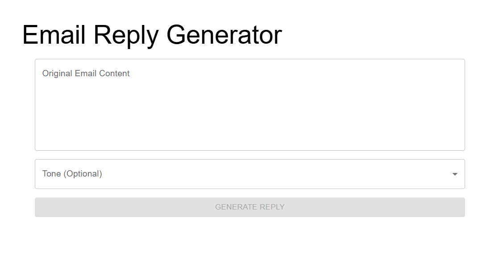
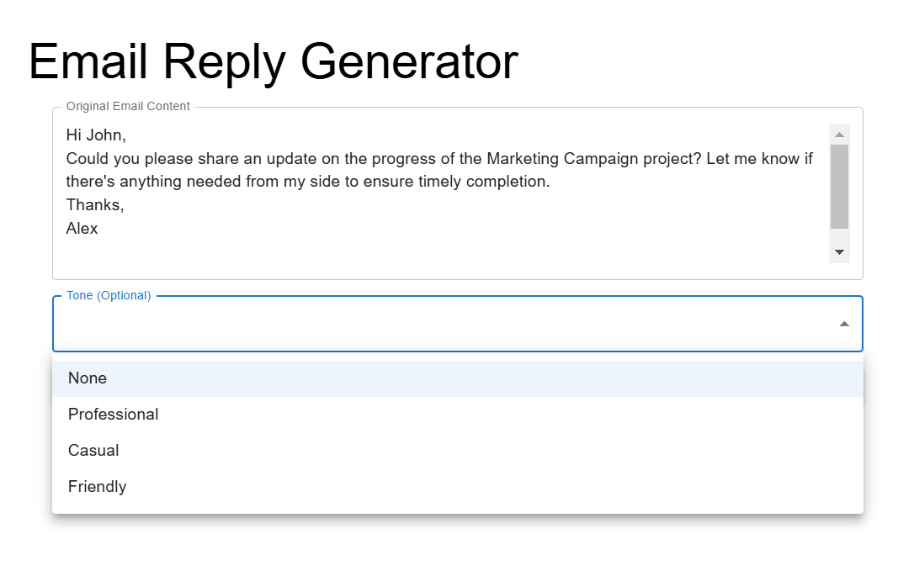
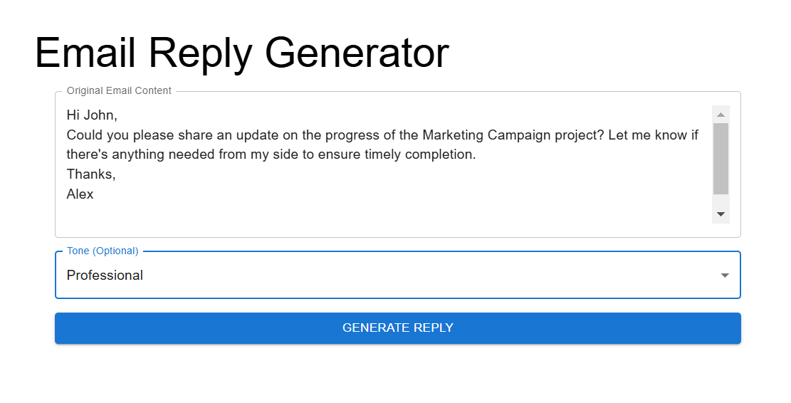
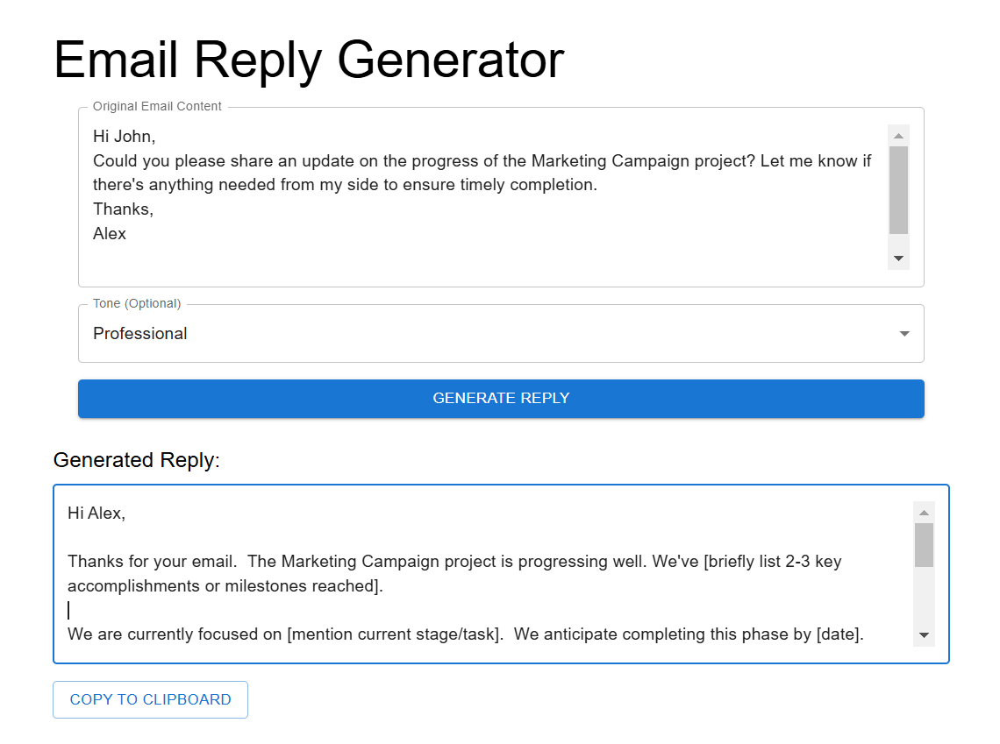
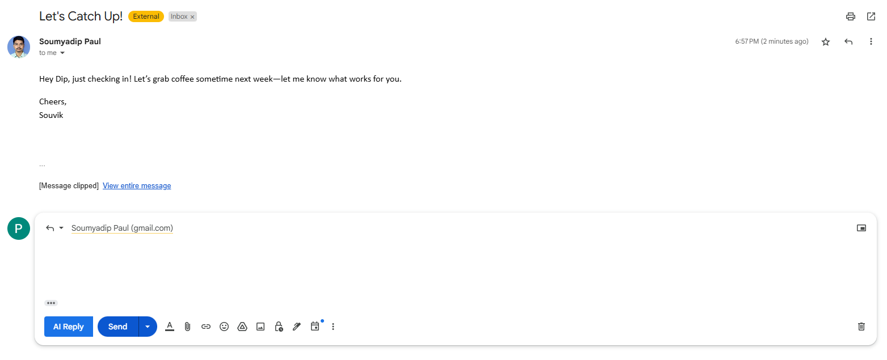
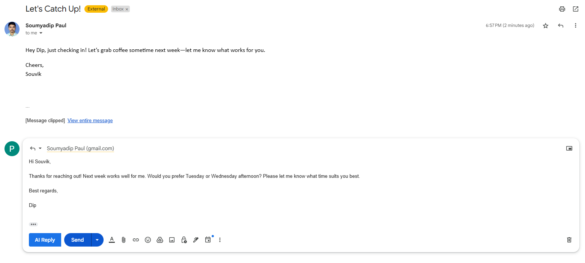

# Smart Email Assistant

Smart Email Assistant is a powerful AI-driven tool designed to streamline email management and composition. Built with Gemini AI, the project integrates a modern React-based frontend, a Spring Boot backend, and a Chrome extension for seamless functionality across platforms.

---

## Features
- **AI-Powered Email Composition**: Generate context-aware email drafts using Gemini AI.
- **Frontend**: Built with React and Vite for a responsive and user-friendly interface.
- **Backend**: Powered by Spring Boot for robust API and backend services.
- **Chrome Extension**: Direct integration into the browser for on-the-go email assistance.
- **Productivity Enhancement**: Automates repetitive email tasks and provides smart suggestions.


---

## Tech Stack
- **Frontend**: React, Vite, Tailwind CSS
- **Backend**: Spring Boot, Java, REST APIs
- **Chrome Extension**: JavaScript, Manifest V3
- **AI Integration**: Gemini AI

---

## Installation and Setup

### Prerequisites
1. **Node.js**: [Download here](https://nodejs.org/)
2. **Java**: [Download here](https://www.oracle.com/java/technologies/javase-downloads.html)
3. **Maven** (for Spring Boot): [Download here](https://maven.apache.org/)
4. **Git**: [Download here](https://git-scm.com/)

### Steps
1. **Clone the Repository**:
   ```bash
   git clone https://github.com/soumyadip0598/Smart-Email-Assistant.git
   cd Smart-Email-Assistant
2. **Frontend(React)**:
   cd email-writer-react
   npm install
   npm run dev
3. **Backend (Spring Boot)**:
   cd email-writer-sb
   mvn spring-boot:run
4. **Chrome Extension**:
   Navigate to chrome://extensions in your browser.
   Enable Developer mode.
   Click Load unpacked and select the email-writer-ext folder.
5. **Usage**
   Start the backend server using Spring Boot.
   Run the frontend locally using React.
   Load the Chrome extension for direct browser integration.
   Use the assistant to draft emails, organize tasks, and boost productivity.
# Smart Email Assistant  

6. **Screenshots**  

### Application Features  

a. **Dashboard View**  
   The main dashboard for managing your email writing tasks.  
   

b. **Email Generation Feature**  
   Easily generate AI-powered email drafts.  
   

c. **Generation Page**  
   Generating an email by uploading original email content.  
   

d. **Email Preview**  
   Preview the AI-generated email before sending.  
   

---

### Chrome Extension Features  

a. **Extension Popup**  
   Access the assistant directly through the Chrome extension popup.  
   

b. **Using the Extension**  
   Demonstration of how to use the extension in your browser.  
   

7. **Contributing**
Contributions are always welcome! If you’d like to contribute to the Smart Email Assistant, the process is simple. Start by forking the repository to your own GitHub account. Then, create a new branch where you can make your changes, and give it an appropriate name. This will allow you to work on new features or improvements without affecting the main codebase.
Once you’ve made your changes, commit them with a clear and concise message. Make sure to explain what you’ve added or fixed. After committing, push your branch to your forked repository. Finally, open a Pull Request to propose your changes, and it will be reviewed for integration into the main project.
We encourage you to follow these steps when contributing: fork the repository, create a new branch, commit your changes, push to your branch, and submit a Pull Request. Your contributions are valuable in making this project better!

8. **License**
This project is licensed under the MIT License, which allows you to freely use, modify, and distribute the code. The full terms of the license can be found in the LICENSE file of the repository. We encourage you to review the license before contributing or using the project in your own work.

9. **Contact**
For any questions, feedback, or suggestions, feel free to reach out. You can contact Soumyadip Paul directly via GitHub at soumyadip0598. Whether you have an issue with the project, want to discuss improvements, or just want to share your experience, the creator is happy to hear from you.
